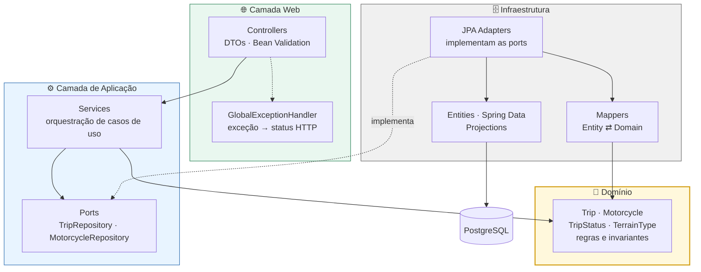
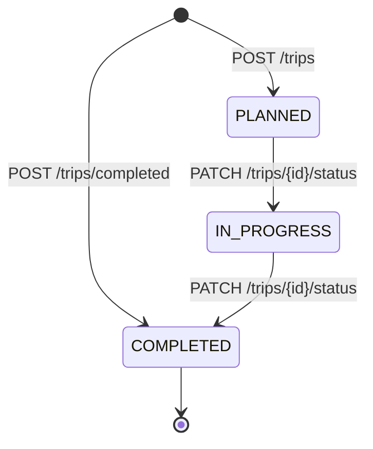

<div align="center">

# 🏍️ MotoTrack API

**Planeje, acompanhe e meça suas viagens de moto.**

API REST construída com domínio isolado de framework, persistência plugável e 98 testes automatizados.

[](https://openjdk.org/)
[](https://spring.io/projects/spring-boot)
[](https://www.postgresql.org/)
[](https://docs.docker.com/compose/)
[](#-testes)
[](#-roadmap)

</div>

---

## 📌 Sobre o projeto

O **MotoTrack** nasceu de uma ideia simples: motociclista gosta de registrar rolê. Quantos quilômetros já rodei? Qual moto da garagem mais pegou estrada? Falta quanto tempo pro próximo destino?

Mas a ideia é só o pretexto. O objetivo real do projeto é exercitar **arquitetura de software em Java** com rigor: um domínio que não sabe que Spring existe, contratos de persistência definidos pela aplicação (não pelo ORM), e uma suíte de testes que cobre cada camada com a ferramenta certa para ela.

O resultado é uma API que evoluiu de um app de console para uma aplicação com banco relacional sem que uma única regra de negócio precisasse ser reescrita.

---

## ✨ Destaques técnicos

| | |
|---|---|
| 🧱 **Domínio puro** | `Trip` e `Motorcycle` não têm uma anotação JPA sequer. Regras de negócio vivem em objetos de domínio, não em services anêmicos. |
| 🔌 **Ports & Adapters** | A aplicação define `TripRepository` e `MotorcycleRepository`. A infraestrutura implementa. Trocar JPA por outra coisa não toca o core. |
| 🚦 **Máquina de estados explícita** | Transições de status vivem no próprio `enum TripStatus`, via `canTransitionTo`. Nada de `if` espalhado. |
| ⏰ **`Clock` injetável** | Nenhuma chamada a `LocalDate.now()` sem `Clock`. Regras que dependem de tempo são testadas com relógio fixo e resultado determinístico. |
| 🏭 **Factory methods nomeados** | `Trip.schedule(...)`, `Trip.registerCompleted(...)` e `Trip.restore(...)` — cada um com suas próprias invariantes. Construtor privado. |
| 📊 **Agregações no banco** | Contagens e somatórios usam JPQL com *projections*. Nada de carregar tudo em memória para fazer `stream().count()`. |
| 🧪 **Testes por camada** | Unitário puro no domínio, fake in-memory nos services, `@WebMvcTest` nos controllers, `@DataJpaTest` + H2 nos adapters. |

---

## 🛠️ Stack

**Core** — Java 25 · Spring Boot 4.1.1 · Spring Web MVC · Spring Data JPA · Bean Validation

**Persistência** — PostgreSQL 17 (produção/dev) · H2 (testes) · Hibernate

**Testes** — JUnit 5 · Mockito · MockMvc

**Infra** — Docker Compose · Maven Wrapper

---

## 🏗️ Arquitetura

A dependência sempre aponta para dentro. O domínio não conhece ninguém; a infraestrutura conhece o domínio.



### Por que as ports ficam na camada de aplicação?

Porque quem dita o contrato é quem precisa dele. O `TripService` não se adapta ao que o Spring Data oferece — ele declara o que precisa (`findUpcomingFrom`, `countByStatus`, `sumDistanceKmByStatus`) e a infraestrutura que se vire. O `JpaTripRepositoryAdapter` traduz esse contrato para Spring Data e converte `TripEntity` em `Trip` pelo caminho.

O efeito prático disso aparece nos testes: `TripServiceTest` roda contra um `InMemoryTripRepository` escrito à mão, sem contexto Spring, sem banco, em 17 milissegundos.

### Estrutura de pacotes

```
br.dev.guisleri.mototrack
├── config/                 ClockConfig — Clock como bean
├── controller/             MotorcycleController · TripController · TripStatisticsController
├── dto/                    Records de request e response
├── exception/              Exceções de negócio + GlobalExceptionHandler
├── model/                  💛 Trip · Motorcycle · TripStatus · TerrainType
├── repository/             🔌 Ports (interfaces)
├── service/                MotorcycleService · TripService · TripStatisticsService
└── persistence/
    ├── entity/             MotorcycleEntity · TripEntity
    ├── mapper/             Entity ⇄ Domain
    ├── projection/         Projections para agregações JPQL
    └── repository/         Adapters + interfaces Spring Data
```

---

## 🧠 Regras de negócio

### Ciclo de vida da viagem



Transições que não aparecem no diagrama são rejeitadas pelo próprio domínio — inclusive pular etapas ou reabrir uma viagem concluída.

### Invariantes garantidas pelo domínio

- Viagem planejada **não pode** ter data no passado.
- Viagem registrada como já concluída **não pode** ter data no futuro.
- Uma viagem só vira `COMPLETED` se a data dela já chegou.
- `daysUntil` só faz sentido para viagem `PLANNED` — pedir para outra gera erro.
- Moto com viagens associadas **não pode** ser excluída (`409 Conflict`).
- `mostUsedMotorcycle` considera apenas viagens `COMPLETED`.

Essas regras estão em `Trip`, `TripStatus` e nos services — **não** nos controllers. A camada web só traduz HTTP.

---

## 🔌 API

Base URL: `http://localhost:8080`

### 🏍️ Motos

| Método | Endpoint | Descrição | Sucesso |
|:---:|---|---|:---:|
| `POST` | `/motorcycles` | Cadastra uma moto na garagem | `201` |
| `GET` | `/motorcycles` | Lista todas as motos | `200` |
| `GET` | `/motorcycles/{id}` | Busca uma moto por ID | `200` |
| `DELETE` | `/motorcycles/{id}` | Remove uma moto sem viagens | `204` |

### 🛣️ Viagens

| Método | Endpoint | Descrição | Sucesso |
|:---:|---|---|:---:|
| `POST` | `/trips` | Agenda uma viagem futura | `201` |
| `POST` | `/trips/completed` | Registra uma viagem já concluída | `201` |
| `GET` | `/trips` | Lista viagens · filtro opcional `?status=PLANNED` | `200` |
| `GET` | `/trips/{id}` | Busca uma viagem por ID | `200` |
| `GET` | `/trips/upcoming` | Próximas viagens planejadas, ordenadas por data | `200` |
| `GET` | `/trips/terrain/{terrain}` | Filtra por `ASPHALT`, `MIXED` ou `OFF_ROAD` | `200` |
| `GET` | `/trips/date/{date}` | Filtra por data (`AAAA-MM-DD`) | `200` |
| `GET` | `/trips/{id}/days-until` | Dias restantes até a viagem | `200` |
| `PATCH` | `/trips/{id}/status` | Avança o status da viagem | `204` |
| `DELETE` | `/trips/{id}` | Remove uma viagem | `204` |

### 📊 Estatísticas

| Método | Endpoint | Descrição | Sucesso |
|:---:|---|---|:---:|
| `GET` | `/statistics` | Resumo consolidado das viagens | `200` |

---

## 🚀 Exemplos de uso

### 1. Colocar uma moto na garagem

```bash
curl -X POST http://localhost:8080/motorcycles \
  -H 'Content-Type: application/json' \
  -d '{
    "brand": "Honda",
    "model": "NX 500",
    "color": "Black",
    "year": 2025,
    "engineCapacity": 471
  }'
```

```json
{
  "id": 1,
  "brand": "Honda",
  "model": "NX 500",
  "color": "Black",
  "year": 2025,
  "engineCapacity": 471
}
```

### 2. Agendar uma viagem

```bash
curl -X POST http://localhost:8080/trips \
  -H 'Content-Type: application/json' \
  -d '{
    "origin": "Florianopolis",
    "destination": "Urubici",
    "distanceKm": 175.5,
    "terrain": "MIXED",
    "tripDate": "2027-01-15",
    "motorcycleId": 1
  }'
```

```json
{
  "id": 1,
  "origin": "Florianopolis",
  "destination": "Urubici",
  "distanceKm": 175.5,
  "status": "PLANNED",
  "terrain": "MIXED",
  "tripDate": "2027-01-15",
  "motorcycle": {
    "id": 1,
    "brand": "Honda",
    "model": "NX 500",
    "color": "Black",
    "year": 2025,
    "engineCapacity": 471
  }
}
```

### 3. Botar o pé na estrada

```bash
curl -X PATCH http://localhost:8080/trips/1/status \
  -H 'Content-Type: application/json' \
  -d '{ "status": "IN_PROGRESS" }'
```

### 4. Ver o resumo

```bash
curl http://localhost:8080/statistics
```

```json
{
  "totalCompletedTrips": 12,
  "totalCompletedDistance": 3480.7,
  "mostUsedMotorcycle": {
    "id": 1,
    "brand": "Honda",
    "model": "NX 500",
    "color": "Black",
    "year": 2025,
    "engineCapacity": 471
  },
  "tripsByStatus": {
    "PLANNED": 3,
    "IN_PROGRESS": 1,
    "COMPLETED": 12
  }
}
```

---

## ⚠️ Tratamento de erros

Exceções de negócio são traduzidas para status HTTP por um `@RestControllerAdvice` central. Nenhum controller escreve `try/catch`.

| Situação | Exceção | Status |
|---|---|:---:|
| Viagem inexistente | `TripNotFoundException` | `404` |
| Moto inexistente | `MotorcycleNotFoundException` | `404` |
| Data inválida para o tipo de registro | `InvalidTripDateException` | `400` |
| Transição de status não permitida | `InvalidTripStatusException` | `400` |
| Exclusão de moto com viagens vinculadas | `MotorcycleInUseException` | `409` |
| Payload que falha na Bean Validation | `MethodArgumentNotValidException` | `400` |

---

## 🧪 Testes

```bash
./mvnw test
```

**98 testes, 0 falhas.** Cada camada é testada com a ferramenta mais barata que dá a garantia necessária:

| Camada | Abordagem | Testes |
|---|---|:---:|
| Domínio | JUnit puro, `Clock` fixo, zero framework | 17 |
| Services | Fake `InMemoryTripRepository` escrito à mão | 21 |
| Controllers | `@WebMvcTest` + `MockMvc` + `@MockitoBean` | 22 |
| Adapters JPA | `@DataJpaTest` + H2 em memória, `create-drop` | 15 |
| Mappers | Unitário direto | 3 |
| Contrato do repositório | Suíte sobre o fake in-memory | 20 |

Dois detalhes que valem o destaque:

**Relógio fixo.** Todo teste que envolve data usa `Clock.fixed(...)`. A suíte de hoje dá o mesmo resultado daqui a três anos.

**Banco descartável.** Os testes de persistência sobem H2 em memória com `create-drop`. O PostgreSQL de desenvolvimento nunca é tocado pela suíte.

---

## ⚙️ Como rodar

### Pré-requisitos

- JDK **25**
- Docker + Docker Compose

### Subida rápida

```bash
git clone https://github.com/marcosguisleri/mototrack-api.git
cd mototrack-api

docker compose up -d      # PostgreSQL 17 na porta 5432
./mvnw spring-boot:run    # API na porta 8080
```

Os valores padrão já funcionam sem nenhuma configuração extra.

### Credenciais customizadas

```bash
cp .env.example .env
# edite o .env com suas credenciais

set -a && source .env && set +a
./mvnw spring-boot:run
```

| Variável | Consumidor | Padrão |
|---|---|---|
| `DB_URL` | Aplicação | `jdbc:postgresql://localhost:5432/mototrack` |
| `DB_USER` | Aplicação | `mototrack` |
| `DB_PASSWORD` | Aplicação | `mototrack123` |
| `POSTGRES_DB` | Docker Compose | `mototrack` |
| `POSTGRES_USER` | Docker Compose | `mototrack` |
| `POSTGRES_PASSWORD` | Docker Compose | `mototrack123` |

> O `.env` não é versionado.

### Encerrando

```bash
docker compose down       # para o banco, preserva os dados
docker compose down -v    # para o banco e apaga o volume
```

---

## 🗺️ Roadmap

O projeto está **em desenvolvimento ativo**. Próximos passos:

- [ ] Documentação interativa com OpenAPI / Swagger UI
- [ ] Corpo de erro padronizado (RFC 7807 — *Problem Details*) no lugar de `String` pura
- [ ] Migrations versionadas com Flyway, substituindo `ddl-auto=update`
- [ ] Paginação e ordenação nas listagens
- [ ] Ampliar a cobertura de `MotorcycleController`
- [ ] Testes de integração ponta a ponta com Testcontainers
- [ ] Pipeline de CI no GitHub Actions
- [ ] Dockerfile da aplicação para subir tudo com um `docker compose up`
- [ ] Autenticação e viagens por usuário

---

## 📜 Evolução do projeto

O histórico de commits conta a história da arquitetura:

```
feat: implementa versão inicial do MotoTrack
feat: adiciona planejamento de viagens por data
feat: implementa garagem, transicoes de status e estatisticas
refactor: separa persistencia de viagens em repository      ← nasce a port
test: adiciona testes automatizados com JUnit
refactor: aprimora dominio e separa estatisticas             ← regras vão pro domínio
feat: adiciona API REST com Spring Boot                      ← entra a camada web
feat: migrate trip persistence to JPA and PostgreSQL         ← entra o adapter JPA
```

Quando o PostgreSQL entrou em cena, **nenhuma regra de negócio precisou mudar**. Só apareceu um adapter novo do outro lado da interface. Era exatamente esse o ponto.

---

<div align="center">

**Marcos Guisleri**

[](https://github.com/marcosguisleri)

*Feito com ☕, 🏍️ e bastante refatoração.*

</div>